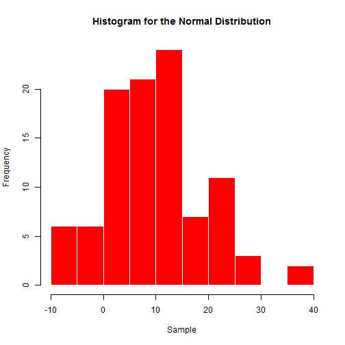
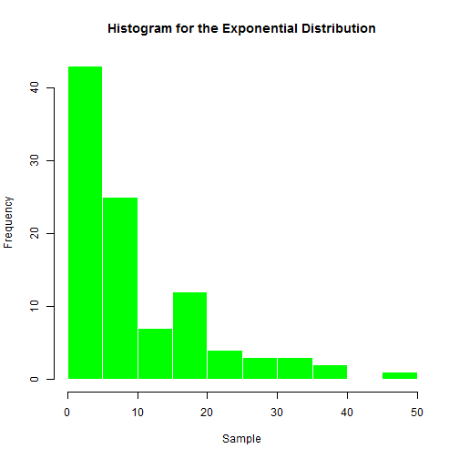
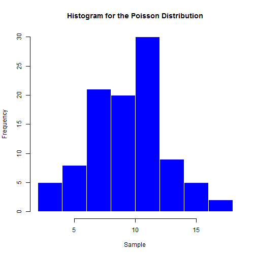

# Developing Data Products Project
 
This project has two parts. 

1. Creating a **Shiny** application and deploy it on Rstudio's servers. 

  1.1 A shiny application has been created. A Shiny application for some common Distributions. The application has been deployed on Rstudio's servers: https://hassanrabie.shinyapps.io/shinyproject/
  
  1.2 The source code has been uploaded to the Github link: https://github.com/HRabie/SlidifyPres1
  
2. Using Slidify or Rstudio Presenter to prepare a reproducible pitch presentation about the application.

  2.1 This Slidify presentation shows some common Distributions: Normal, Exponential and Poisson

---

# 1 The Normal Distribution
The normal (or Gaussian) distribution is a very common continuous probability distribution.

```r
SampleT<-rnorm(100,mean=10,sd=10)
hist(SampleT,main="Histogram for the Normal Distribution",
           col="red",border="white",xlab="Sample" )
```



---

# 2 The Exponential Distribution

```r
SampleT<-rexp(100,1/10)
hist(SampleT,main="Histogram for the Exponential Distribution",
           col="green",border="white",xlab="Sample" )
```



---

# 3 The Poisson Distribution

```r
SampleT<- rpois(100,10)
hist(SampleT,main="Histogram for the Poisson Distribution",
           col="blue",border="white",xlab="Sample" )
```


